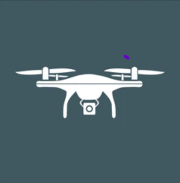

# Live Streaming a DJI drone into Run AI for near real time object detection with YOLO

  
  

This project provides a real-time video streaming application using a drone, with live object detection powered by the YOLO model. The system is built to stream the video feed from the drone, process the stream using YOLO, and display both the raw and annotated streams on a web interface. The application leverages Kubernetes, Streamlit, and Grafana for streaming, inference, and monitoring.

## Features

- **Live Drone Video Streaming**: Streams video feed from a drone in real-time.
- **YOLOv11 Inference**: Applies YOLO object detection to the stream, annotating the detected objects.
- **Stream Selection**: Provides an option to view either the live raw stream or the annotated stream.
- **GPU Utilization Monitoring**: Integrates with Prometheus and Grafana to monitor GPU usage during inference.

## Example Use Cases

- Surveillance: Use the system to monitor an area in near real-time and automatically detect objects such as vehicles, people, etc.

- Demonstrations: A MVP tool for demonstrating how real-time object detection can be achieved with a streaming source and YOLO.

## How It Works

- The drone sends a real-time video feed using RTMP to an RTMP server running in Kubernetes.
- The stream is processed using YOLO for object detection.
- The processed stream (with annotations) is served over HLS.
- A Streamlit web interface provides options to view either the live raw feed or the annotated stream.
- Prometheus and Grafana are used to monitor the GPU utilization during the inference process.

## Prereqs

To run this project, ensure the following dependencies are installed:

- **Run AI** cluster with GPU nodes (for YOLO inference)
- **Host Based Routing Enabled** to correctly expose the endpoints

## Install

- Clone this repo
- Change into the "yolo-drone" dir
- Modify the values.yaml file
- Helm install with `helm install drone-stream .`
 